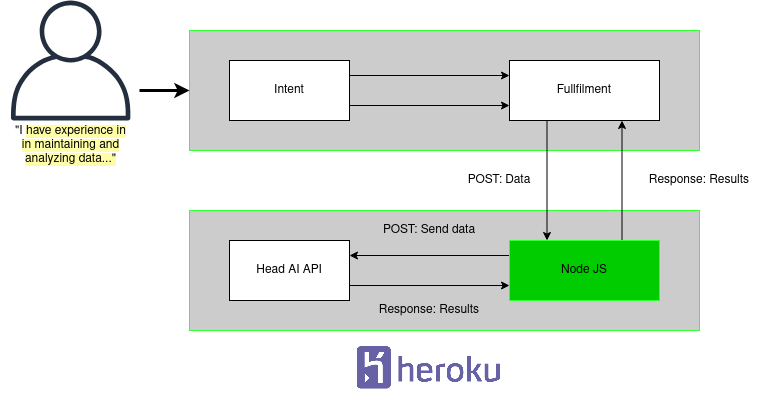

# Text to skills and keywords to jobs/courses

Project was created for a 1-day hackathon that was organized online.
Project is created using HeadAI's Semantic AI to fetch data with API query calls. Hackathon was
held on 01.04 and presented with HeadAI's Microcompetencies platform. By using the platform, students can compare their skills and future job market, 
and see how well their skills match the labor market. All three universities of applied sciences organized parallelly separate events. Yet, all the events had common lectures from world-class speakers. 
The events proved that the result is just as good as in real life, if the participants are motivated.
(03.04.2020, quoted from this <a href="https://www.3amk.fi/en/2020/04/03/first-virtual-hackathon-succeeded-beyond-expectations/">article</a>). 

<a href="https://headai-text-to-skills-85t5322.herokuapp.com/">Link to app on heroku</a>

## Description
Instead of using Dialogflow and Firebase database I had decided to use MongoDB, React and Heroku to publish the app. 
NodeJS uses a RESTful API endpoint to receive a request body. Request body is forwarded to HeadAI's API. 
Response is validated and notification message is displayed to the user in front-end. Axios library is used to post a request.

## Getting Started
These instructions will get you a copy of the project up and running on your local machine for development and testing purposes.

### Prerequisites
To get started you need a computer, internet connection (for API) and your favourite code editor. I used VS Code, but you can use Webstorm or whichever you're comfortable with.

### Usage
Clone or download this repo to your local machine.
<details><summary>Show instructions</summary>

1. Open project in code editor.

2. Install node_module packages:
```sh 
$ npm install
```

3. Start backend server from terminal:
```sh 
$ npm run dev
```
4. Launch a second terminal and navigate to client directory and run:
```sh 
$ npm start
```

</details>

## Running the tests
You can run all tests:
```sh 
$ npm run test 
```
or run individual test:
```sh 
$ npm test -- tests/text_to_skills_api.test.js
```

### Diagram
How the app works in a nutshell.
Diagram includes Dialogflow's fullfilments that are not yet implemented as endpoints.
<p align = "center">

</p>

## Further features, changes and fixes
### Features
<ul>
  <li>Dialogflow integration</li>
  <li>Statistics tab</li>
</ul>

### Changes

<ul>
  <li>Better course display information</li>
  <li>Use redux instead of hook states</li>
</ul>

### Fixes

<ul>
  <li>7 failed backend tests</li>
  <li>Notification display time bug</li>
  <li>Correct notification information</li>
</ul>

## Acknowledgements
Thanks to people at HeadAI for giving an opportunity to use and experiment with this API.
